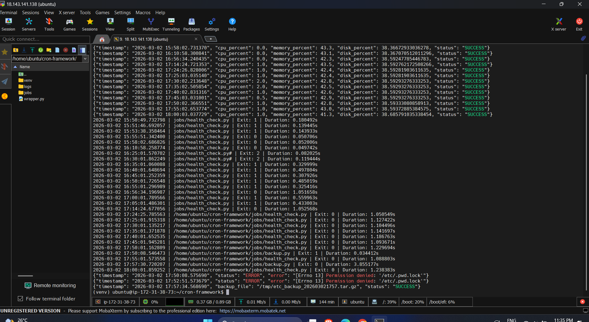

# Python Cron Job Automation & Monitoring Framework

## Step 1 — Install Python and pip

```text
sudo apt install python3 python3-venv python3-pip -y
```
- `python3-venv` → needed for virtual environments
- `pip3` → for Python packages

## Step 2 — Create Project Structure

```text
mkdir -p ~/cron-framework/{jobs,logs}
cd ~/cron-framework
```
- folder will look like:
```text
cron-framework/
    jobs/   # Python job scripts
    logs/   # Log files
    wrapper.py   # Monitoring wrapper
```

## Step 3 — Create Virtual Environment

```text
python3 -m venv venv
source venv/bin/activate
```
- Now your prompt should start with (venv)
- All Python packages installed now will stay inside this environment

## Step 4 — Install Dependencies

```text
pip install psutil
```
- `psutil` → CPU, memory, disk stats

## Step 5 — Create Health Check Python Job

```text
jobs/health_check.py
```

## Step 6 — Create Wrapper Python Script

```text
wrapper.py
```

## Step 7 — Create Backup Job

```text
jobs/backup.py
```

## step 8 - Add Cron Jobs

```text
crontab -e
```
```text
# Health check every 5 minutes
*/5 * * * * /home/ubuntu/cron-framework/venv/bin/python /home/ubuntu/cron-framework/wrapper.py /home/ubuntu/cron-framework/jobs/health_check.py

# Backup daily at 2 AM (needs root if backing up /etc)
0 2 * * * /home/ubuntu/cron-framework/venv/bin/python /home/ubuntu/cron-framework/wrapper.py /home/ubuntu/cron-framework/jobs/backup.py
```

## Result


