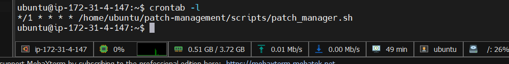
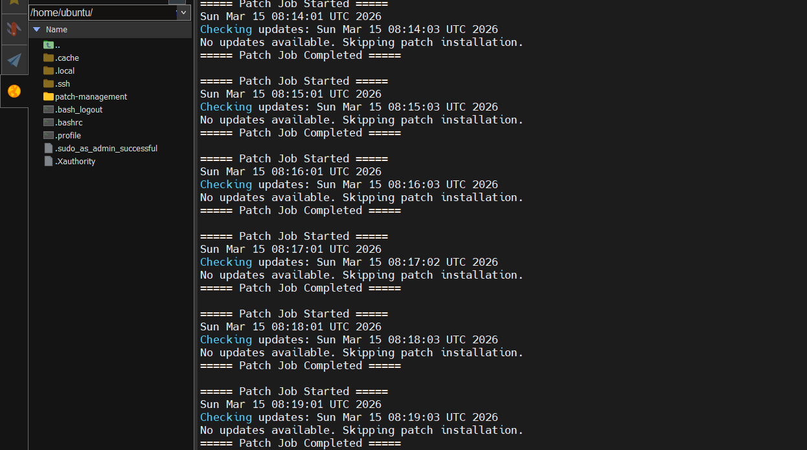

# Automated Patch Management System for Linux

Automated Linux patch management system built with Bash. The script checks system repositories for available package updates, installs patches only when necessary, and logs the entire process. Designed for scheduled execution using cron, it helps maintain server security and stability by ensuring systems remain updated without requiring manual administrative intervention.

- Project Structure
```text
patch-management
 ├── scripts
 │    ├── check_updates.sh
 │    ├── install_updates.sh
 │    └── patch_manager.sh
 │
 └── logs
      └── patch.log
```

## Step 1 - Create Project Directory

```text
mkdir patch-management
cd patch-management
```
```text
mkdir logs scripts
```

## Step 2 - Write Code

Write bash code for check_updates.sh,install_updates.sh and patch_manager.sh

- check_updates.sh : Bash script that checks Linux packages for available upgrades and writes the update information with timestamp into a log file.
- install_updates.sh : Checks system for available Linux package updates, logs timestamp, refreshes repositories, and simulates upgrade process without installing patches automatically.
- patch_manager.sh : Automated Linux patch management script that refreshes repositories, checks for available upgrades, installs updates only when patches exist, and logs the entire process with timestamps to a centralized log file.

## Step 3 - Add crone job

- Open the crontab editor
```text
crontab -e
```
- Add the cron job (Ex: I add for every 1 minutes)
```text
*/1 * * * * /home/ubuntu/patch-management/scripts/patch_manager.sh
```

Compleet !





- Check if Cron Runs
```text
cat ~/patch-management/logs/patch.log
```

